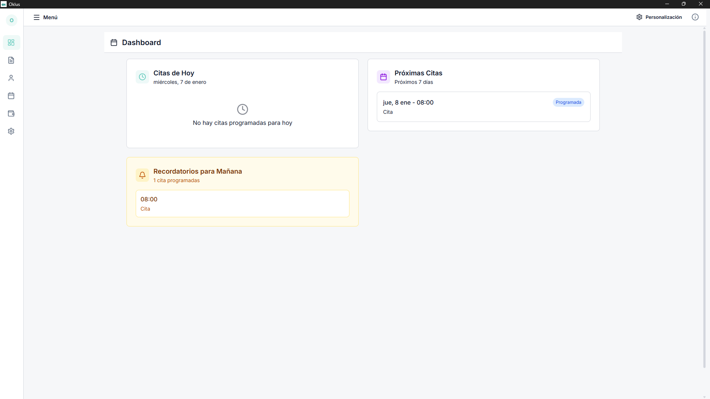
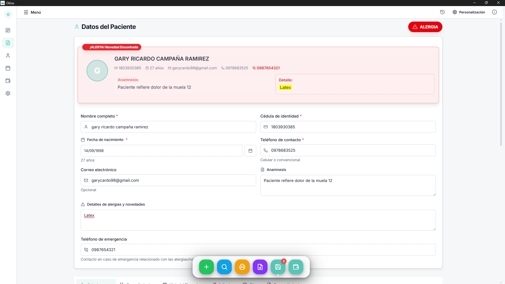
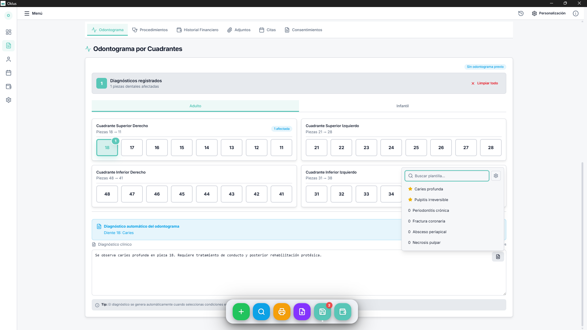
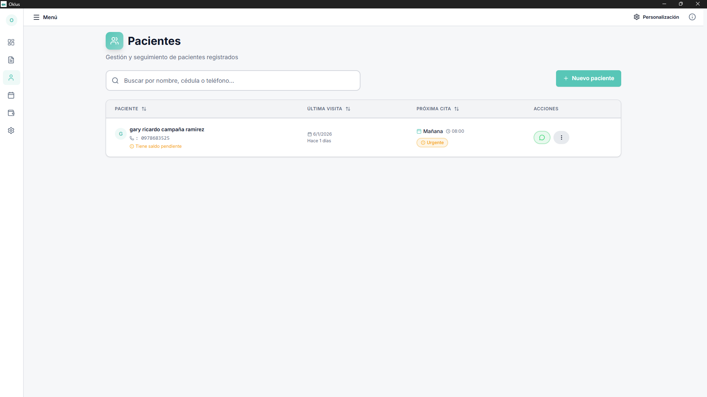
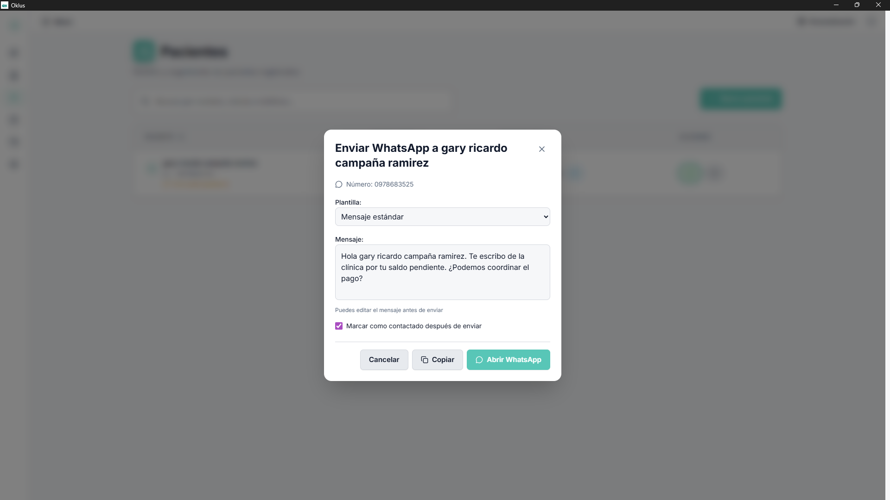
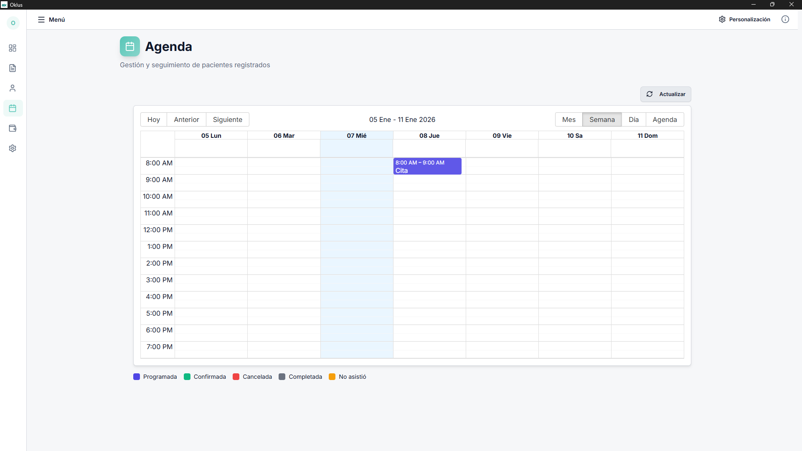
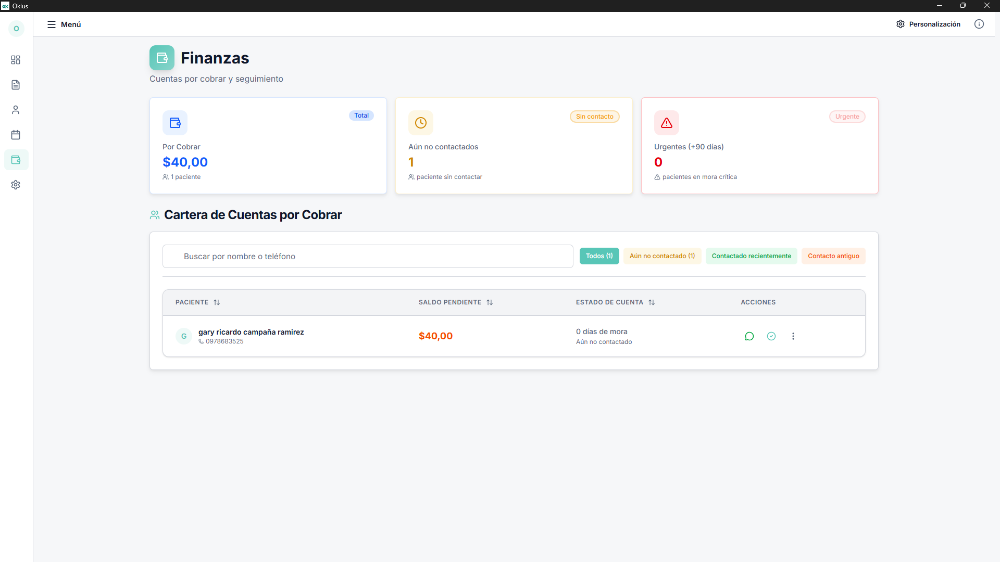

# 🦷 Oklus

**Sistema de gestión dental profesional, rápido y 100% offline**

[Características](#-características-destacadas) • [Capturas](#-capturas) • [Instalación](#-instalación) • [Documentación](#-documentación)

---

## 🎯 ¿Por qué Oklus?

Oklus es una aplicación **nativa de escritorio** diseñada para clínicas dentales que necesitan:

- ✅ **Trabajar sin internet** - 100% offline, sin depender de la nube
- ⚡ **Rendimiento nativo** - Respuesta instantánea, sin lag
- 🔒 **Datos locales** - Tu información nunca sale de tu computadora
- 🪶 **Instalación ligera** - Solo ~4MB vs 100MB+ de otras soluciones
- 🎨 **Interfaz moderna** - Diseño limpio y fácil de usar

---

## 🌟 Características Destacadas

### 📋 Gestión de Pacientes
- Ficha completa: datos personales, alergias, anamnesis
- Búsqueda instantánea por nombre o documento
- Historial médico completo con timeline
- Adjuntos: radiografías, fotos, documentos

### 🦷 Odontograma Interactivo
- Dentición permanente (11-48) y decidua (51-85)
- Selección visual de dientes
- Diagnósticos automatizados por pieza
- Exportación a PDF

### 💰 Control Financiero
- Presupuestos y cotizaciones
- Seguimiento de pagos y saldos pendientes
- Múltiples métodos de pago
- Historial de transacciones

### 📅 Citas y Recordatorios
- Calendario integrado
- Detección de conflictos de horarios
- Recordatorios automáticos por WhatsApp (semi-automático)

### 🔐 Consentimientos Informados
- Plantillas predefinidas (extracción, endodoncia, cirugía, etc.)
- Firma digital en canvas
- Almacenamiento seguro en PDF

---

## 🚀 Instalación

### Descarga desde GitHub Releases

1. Ve a la [página de Releases](https://github.com/RicardoCR98/oklus/releases)
2. Descarga el instalador para tu sistema operativo:
   - **Windows**: `Oklus_x.x.x_x64-setup.exe`
   - **macOS**: `Oklus_x.x.x_x64.dmg`
   - **Linux**: `oklus_x.x.x_amd64.deb` o AppImage
3. Ejecuta el instalador y sigue las instrucciones

### Requisitos del Sistema
- **Windows 10/11** - WebView2 se instala automáticamente
- **macOS 10.15+** - Safari WebKit integrado
- **Linux** - WebKit2GTK, GTK3 (instaladas en la mayoría de distribuciones modernas)

### Actualizaciones Automáticas
Oklus verifica e instala actualizaciones automáticamente. Revisa la configuración en **Ajustes → Sistema**.

---

## 📸 Capturas

👁️ Ver capturas de pantalla

### Dashboard

### Registro Clínico

### Odontograma Interactivo

### Gestión de Pacientes

### Plantillas

### Citas y Recordatorios

### Gestión de Finanzas

---

## 🛠️ Stack Tecnológico

### Frontend
- **React 19** + **TypeScript 5.9** - UI moderna y type-safe
- **Tailwind CSS 4** - Estilos utility-first
- **Radix UI** - Componentes accesibles
- **Zustand** - State management minimalista
- **TanStack Virtual** - Listas virtualizadas

### Desktop/Backend
- **Tauri 2.8** - Shell nativa (no Electron)
- **Rust 1.77+** - Backend seguro y rápido
- **SQLite + WAL** - Base de datos local con concurrencia
- **SQLx** - Driver async de SQL

### Tamaño Final
- **Instalador**: ~4-5 MB (vs 100+ MB con Electron)
- **RAM en uso**: ~80-120 MB (vs 300-500 MB con Electron)

---

## 📚 Documentación

### Para Desarrolladores
- [**Arquitectura**](docs/ARCHITECTURE.md) - C4 model, decisiones técnicas
- [**Guía del Codebase**](docs/CODEBASE_GUIDE.md) - Navegación del código
- [**State Management**](docs/STATE_MANAGEMENT.md) - Zustand + Custom Hooks
- [**Estándares de Código**](docs/CODING_STANDARDS.md) - Convenciones

### Para Usuarios
- [**Guía de Auto-Actualización**](AUTO_UPDATE_GUIDE.md) - Configurar updates automáticos

📖 [Ver toda la documentación →](docs/README.md)

---

## 🗺️ Roadmap

### ✅ Versión Actual (v0.1.x)
- [x] Gestión de pacientes
- [x] Odontograma interactivo
- [x] Control financiero
- [x] Citas y recordatorios
- [x] Consentimientos informados
- [x] Auto-actualización

### 🔜 Próximas Versiones

**v0.2.0** - Testing & Calidad
- [ ] Suite de tests (Vitest + React Testing Library)
- [ ] Validación de formularios con Zod
- [ ] Migración progresiva a TypeScript estricto

**v0.3.0** - Reportes & Analytics
- [ ] Dashboard de estadísticas
- [ ] Exportación de reportes a PDF/Excel
- [ ] Gráficos de ingresos y procedimientos

**v1.0.0** - Estabilidad
- [ ] Backup automático
- [ ] Multi-usuario (opcional)
- [ ] Sincronización en la nube (opcional)

---

## 🤝 Desarrollo

Este es un proyecto **de código cerrado**. El desarrollo está gestionado por el autor.

Si encuentras un bug o tienes una sugerencia:
- 🐛 Reporta issues en [GitHub Issues](https://github.com/RicardoCR98/oklus/issues)
- 💡 Envía sugerencias de mejora
- 📧 Contacta directamente al autor

**Nota**: Las contribuciones de código requieren autorización previa del autor.

---

## 📄 Licencia

**Copyright © 2025 Gary Ricardo Campaña Ramírez. Todos los derechos reservados.**

Este software es **propietario y confidencial**. El código fuente no es de código abierto.

### Restricciones
- ❌ Copiar, modificar o distribuir el código fuente
- ❌ Uso comercial sin autorización expresa
- ❌ Ingeniería inversa o descompilación
- ❌ Redistribución del software

### Uso Autorizado
✅ Solo para evaluación y uso personal según los términos acordados con el autor.

Ver [LICENSE](LICENSE) para detalles completos de la licencia propietaria.

---

## 👨‍💻 Autor

**Gary Ricardo Campaña Ramírez**

- 📧 Email: garycardo98@gmail.com
- 🐙 GitHub: [@RicardoCR98](https://github.com/RicardoCR98)

---

**¿Te gusta Oklus?** Dale una ⭐ en GitHub

Hecho con ❤️ para la comunidad dental

