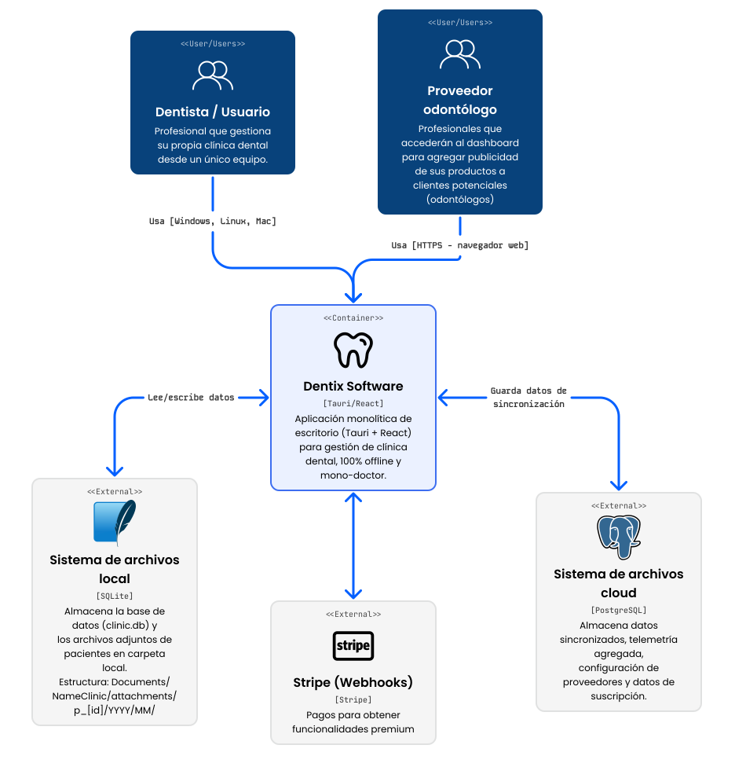
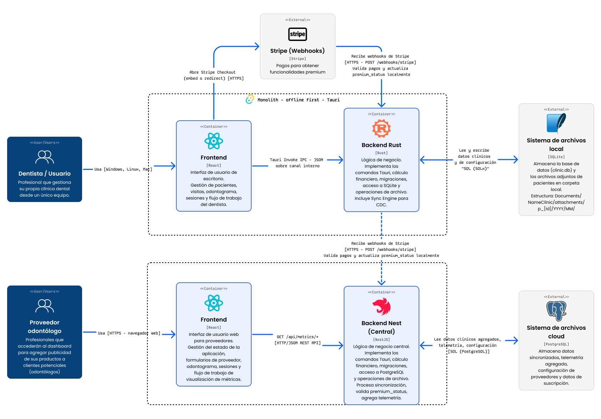

# Architecture Documentation - Dentix Desktop

## Overview

Dentix is a **desktop-first, offline-first dental clinic management system** built with modern web technologies wrapped in a native desktop application. The application follows a **monolithic desktop architecture** where frontend and backend run in a single bundled executable.

## C4 Model Diagrams

### Level 1: System Context



**Key Characteristics:**
- **100% Offline**: No internet connection required
- **Mono-doctor**: Single doctor per installation
- **Local-first**: All data stored locally in SQLite
- **Desktop-native**: Cross-platform (Windows, macOS, Linux)

### Level 2: Container Diagram


### Level 3: Component Diagram (Frontend)

```
┌────────────────────────────────────────────────────────────────┐
│                    Frontend Application (React)                │
│                                                                │
│  ┌──────────────────────────────────────────────────────────┐  │
│  │                      App.tsx                             │  │
│  │              (Main Application Component)                │  │
│  │                                                          │  │
│  │  • All application state (useState)                      │  │
│  │  • Patient, Visit, ToothDx, Sessions                     │  │
│  │  • Event handlers (handleSave, handleNew)                │  │
│  │  • Keyboard shortcuts (Ctrl+S, Ctrl+K)                   │  │
│  │                                                          │  │
│  └───┬──────────────┬──────────────┬──────────────┬─────────┘  │
│      │              │              │              │            │
│      ▼              ▼              ▼              ▼            │
│  ┌────────┐   ┌──────────┐   ┌──────────┐   ┌──────────┐     │
│  │Patient │   │Odontogram│   │Diagnosis │   │Sessions  │     │
│  │  Form  │   │Component │   │   Area   │   │  Table   │     │
│  └────────┘   └──────────┘   └──────────┘   └──────────┘     │
│      │              │              │              │            │
│      └──────────────┴──────────────┴──────────────┘            │
│                     │                                          │
│                     ▼                                          │
│  ┌──────────────────────────────────────────────────────────┐  │
│  │                  UI Components Layer                     │  │
│  │                    (src/components/ui/)                  │  │
│  │                                                          │  │
│  │  Button, Input, Textarea, Select, DatePicker, Dialog,   │  │
│  │  Popover, Toast, Badge, Card, Table, Tabs, Alert        │  │
│  │                                                          │  │
│  │  Built on Radix UI primitives                           │  │
│  └──────────────────────────────────────────────────────────┘  │
│                     │                                          │
│                     ▼                                          │
│  ┌──────────────────────────────────────────────────────────┐  │
│  │                  Theme System                            │  │
│  │                                                          │  │
│  │  ThemeProvider → CSS Variables (HSL)                     │  │
│  │  Presets: light, dark                                    │  │
│  │  Fonts: Inter, Poppins, Roboto, System                   │  │
│  │  Storage: localStorage                                   │  │
│  └──────────────────────────────────────────────────────────┘  │
│                     │                                          │
│                     ▼                                          │
│  ┌──────────────────────────────────────────────────────────┐  │
│  │              Data Access Layer                           │  │
│  │          (src/lib/storage/TauriSqliteRepository.ts)      │  │
│  │                                                          │  │
│  │  • searchPatients()                                      │  │
│  │  • getSessionsByPatient()                                │  │
│  │  • saveVisitWithSessions()                               │  │
│  │  • getProcedureTemplates()                               │  │
│  │  • getSigners()                                          │  │
│  │  • invoke() calls to Rust backend                        │  │
│  └──────────────────────────────────────────────────────────┘  │
│                                                                │
└────────────────────────────────────────────────────────────────┘
```

### Level 3: Component Diagram (Backend)

```
┌────────────────────────────────────────────────────────────────┐
│                    Backend Application (Rust)                  │
│                                                                │
│  ┌──────────────────────────────────────────────────────────┐  │
│  │                      main.rs                             │  │
│  │                 (Tauri Entry Point)                      │  │
│  │                                                          │  │
│  │  • Initialize SQLite pool                                │  │
│  │  • Register Tauri commands                               │  │
│  │  • Configure plugins (SQL, FS, Opener)                   │  │
│  │  • Window setup                                          │  │
│  └───────────────────────┬──────────────────────────────────┘  │
│                          │                                     │
│                          ▼                                     │
│  ┌──────────────────────────────────────────────────────────┐  │
│  │                   commands.rs                            │  │
│  │                (Tauri Command Handlers)                  │  │
│  │                                                          │  │
│  │  Patient Commands:                                       │  │
│  │   • search_patients()                                    │  │
│  │   • find_patient_by_id()                                 │  │
│  │   • upsert_patient()                                     │  │
│  │                                                          │  │
│  │  Visit Commands:                                         │  │
│  │   • get_visits_by_patient()                              │  │
│  │   • get_sessions_by_patient()                            │  │
│  │   • get_sessions_by_visit()                              │  │
│  │   • save_visit_with_sessions()                           │  │
│  │   • delete_visit()                                       │  │
│  │                                                          │  │
│  │  Master Data Commands:                                   │  │
│  │   • get_procedure_templates()                            │  │
│  │   • save_procedure_templates()                           │  │
│  │   • get_diagnosis_options()                              │  │
│  │   • save_diagnosis_options()                             │  │
│  │   • get_signers(), create_signer(), delete_signer()      │  │
│  │   • get_reason_types(), create_reason_type()             │  │
│  │                                                          │  │
│  │  Settings Commands:                                      │  │
│  │   • get_all_settings()                                   │  │
│  │   • save_setting()                                       │  │
│  └───────────────────────┬──────────────────────────────────┘  │
│                          │                                     │
│                          │ SQLx queries                        │
│                          │                                     │
│                          ▼                                     │
│  ┌──────────────────────────────────────────────────────────┐  │
│  │                    SQLite Database                       │  │
│  │                                                          │  │
│  │  Tables:                                                 │  │
│  │   • doctor_profile                                       │  │
│  │   • patients                                             │  │
│  │   • visits                                               │  │
│  │   • visit_procedures                                     │  │
│  │   • attachments                                          │  │
│  │   • procedure_templates                                  │  │
│  │   • signers                                              │  │
│  │   • diagnosis_options                                    │  │
│  │   • reason_types                                         │  │
│  │   • user_settings                                        │  │
│  │   • telemetry_events                                     │  │
│  │   • error_logs                                           │  │
│  │   • sync_queue                                           │  │
│  └──────────────────────────────────────────────────────────┘  │
│                                                                │
└────────────────────────────────────────────────────────────────┘
```

## Architecture Decisions

### 1. Tauri over Electron

**Decision**: Use Tauri 2.8.0 instead of Electron

**Rationale**:
- **Performance**: Tauri apps are 10-100x smaller than Electron (4MB vs 100MB+)
- **Memory**: Uses native webview instead of bundling Chromium
- **Security**: Rust backend provides memory safety and type safety
- **Resource Usage**: Lower CPU and RAM consumption
- **Native Integration**: Better OS-level integration

**Trade-offs**:
- Smaller ecosystem than Electron
- Rust learning curve for backend
- WebView differences between platforms (WebView2 on Windows, WebKit on macOS/Linux)

### 2. SQLite with WAL Mode

**Decision**: Use SQLite with Write-Ahead Logging (WAL) mode

**Rationale**:
- **Concurrent Reads**: WAL allows multiple readers while writer is active
- **Performance**: Faster writes, no blocking on reads
- **Reliability**: Better crash recovery
- **Offline-first**: No server dependency
- **Simplicity**: No database server to manage

**Configuration**:
```sql
PRAGMA journal_mode = WAL;        -- Concurrent reads
PRAGMA busy_timeout = 10000;      -- 10s timeout
PRAGMA synchronous = NORMAL;      -- Balance safety/speed
```

### 3. Direct Frontend-Backend Type Alignment

**Decision**: Use identical types across TypeScript and Rust (eliminated wrapper types)

**Rationale**:
- **Zero Transformation**: No conversion overhead between frontend and backend
- **Type Safety**: TypeScript types match Rust structs exactly
- **Reduced Errors**: Eliminates entire class of type mismatch bugs
- **Maintainability**: Single source of truth for data structures

**Example**:
```typescript
// TypeScript (types.ts)
export type VisitWithProcedures = {
  visit: Visit;
  items: VisitProcedure[];
};

// Rust (commands.rs)
pub struct SessionRow {
    #[serde(flatten)]
    pub visit: Visit,
    pub items: Vec<VisitProcedure>,
}
```

### 4. Denormalization Strategy

**Decision**: Intentionally denormalize data for immutable history

**Rationale**:
- **Snapshot Semantics**: Visit records must not change when master data changes
- **Historical Accuracy**: Prices, doctor names, diagnoses frozen at time of visit
- **Audit Trail**: Can see exactly what was recorded at time of visit
- **Performance**: No joins needed for historical queries

**Implementation**:
- `visits.reason_type`: Stores text snapshot, not FK to reason_types
- `visits.signer`: Stores doctor name snapshot, not FK to signers
- `visit_procedures.name`: Stores procedure name snapshot
- `visit_procedures.unit_price`: Stores price at time of visit

### 5. Mono-Component State Management

**Decision**: All state in App.tsx, no Redux/Zustand

**Rationale**:
- **Simplicity**: Single source of truth in one file
- **Performance**: No middleware overhead
- **Debugging**: Easy to trace state changes
- **Small Scope**: Desktop app with single user, limited concurrent operations

**State Structure**:
```typescript
const [patient, setPatient] = useState<Patient | null>(null);
const [visit, setVisit] = useState<Visit>({ /* defaults */ });
const [toothDx, setToothDx] = useState<ToothDx>({});
const [sessions, setSessions] = useState<VisitWithProcedures[]>([]);
const [attachments, setAttachments] = useState<AttachmentFile[]>([]);
const [procedureTemplates, setProcedureTemplates] = useState<ProcedureTemplate[]>([]);
```

### 6. File Storage Outside Database

**Decision**: Store attachment files on filesystem, metadata in database

**Rationale**:
- **Performance**: BLOBs in SQLite slow down queries and backups
- **Scalability**: File system handles large files better
- **Portability**: Easy to backup/restore files separately
- **OS Integration**: Can open files with native applications

**Storage Pattern**:
```
Documents/GreenAppleDental/attachments/
  p_{patient_id}/
    YYYY/
      MM/
        {timestamp}_{random}_{filename}
```

### 7. Financial Calculation Centralization

**Decision**: All financial calculations in Rust backend

**Rationale**:
- **Consistency**: Single source of truth for business logic
- **Accuracy**: Rust's type system prevents floating-point errors
- **Audit**: Calculations traceable to single code location
- **Testing**: Easier to unit test in Rust

**Implementation**:
```rust
let cumulative_balance = previous_cumulative + session.visit.balance;
// Where balance = budget - discount - payment
```

### 8. Migrations on Startup

**Decision**: Run database migrations automatically on app launch

**Rationale**:
- **User Experience**: No manual database setup required
- **Reliability**: Every app launch ensures schema is current
- **Simplicity**: No separate migration tool needed
- **Safety**: Migrations are idempotent (CREATE IF NOT EXISTS)

**Implementation**:
- Migrations stored in `src-tauri/migrations/`
- Executed in order on app startup
- Migration state tracked in `_sqlx_migrations` table (if using sqlx-cli) or manually

## Data Flow Architecture

### Save Visit Flow

```
┌─────────────┐
│    User     │
│ Clicks Save │
└──────┬──────┘
       │
       ▼
┌──────────────────────────────────────┐
│ App.tsx: handleSave()                │
│                                      │
│ 1. Validate patient data             │
│ 2. Calculate balances                │
│ 3. Convert ToothDx → JSON string     │
│ 4. Save attachment files to disk     │
└──────┬───────────────────────────────┘
       │
       │ invoke("save_visit_with_sessions", {...})
       │
       ▼
┌──────────────────────────────────────┐
│ Rust: save_visit_with_sessions()     │
│                                      │
│ BEGIN TRANSACTION                    │
│   1. Upsert patient                  │
│   2. For each session:               │
│      - Calculate cumulative balance  │
│      - Upsert visit                  │
│      - Delete old procedures         │
│      - Insert new procedures         │
│ COMMIT TRANSACTION                   │
│                                      │
│ Return { patient_id, visit_id }      │
└──────┬───────────────────────────────┘
       │
       │ Promise resolves
       │
       ▼
┌──────────────────────────────────────┐
│ App.tsx: After save                  │
│                                      │
│ 1. Update local state with IDs       │
│ 2. Mark sessions as saved            │
│ 3. Save attachment metadata to DB    │
│ 4. Show success toast                │
└──────────────────────────────────────┘
```

### Load Patient Flow

```
┌─────────────┐
│    User     │
│Selects Patient│
└──────┬──────┘
       │
       ▼
┌──────────────────────────────────────┐
│ App.tsx: handleSelectPatient()       │
│                                      │
│ PARALLEL LOAD (Promise.all):         │
│   1. repo.findPatientById()          │
│   2. repo.getVisitsByPatient()       │
│   3. repo.getSessionsByPatient()     │
│   4. repo.getAttachmentsByPatient()  │
└──────┬───────────────────────────────┘
       │
       │ Multiple invoke() calls in parallel
       │
       ▼
┌──────────────────────────────────────┐
│ Rust: Multiple commands              │
│                                      │
│ • find_patient_by_id()               │
│ • get_visits_by_patient()            │
│ • get_sessions_by_patient()          │
│   - Loads visit                      │
│   - Loads procedures for visit       │
│   - Returns VisitWithProcedures[]    │
│ • get_attachments_by_patient()       │
└──────┬───────────────────────────────┘
       │
       │ All promises resolve
       │
       ▼
┌──────────────────────────────────────┐
│ App.tsx: After load                  │
│                                      │
│ 1. Set patient state                 │
│ 2. Set visit state (last visit)      │
│ 3. Parse tooth_dx_json → ToothDx     │
│ 4. Set sessions state                │
│ 5. Set attachments state             │
│ 6. Focus first input                 │
└──────────────────────────────────────┘
```

## Security Architecture

### Data Security

**Local Data Protection**:
- SQLite database stored in OS-protected user directory
- File permissions: User-only read/write (600)
- No network exposure: 100% offline

**Future Considerations** (not yet implemented):
- Database encryption (SQLCipher)
- Attachment file encryption
- User authentication/multi-user support

### Code Security

**Rust Memory Safety**:
- No buffer overflows
- No use-after-free
- No data races
- Compile-time guarantees

**Tauri Security**:
- CSP (Content Security Policy) configured
- Limited IPC surface area
- No remote code execution
- Sandboxed WebView

## Performance Optimizations

### Database Performance

1. **WAL Mode**: Concurrent reads, faster writes
2. **Indexes**: Strategic indexes on foreign keys and frequently queried columns
3. **Prepared Statements**: SQLx uses prepared statements by default
4. **Connection Pooling**: Single connection pool for entire app

### Frontend Performance

1. **No Unnecessary Rerenders**: State localized to App.tsx, minimal prop drilling
2. **Debouncing**: 150ms debounce on dialog loading to avoid race conditions
3. **Local State Updates**: Update state with returned IDs instead of reloading from DB
4. **Lazy Loading**: Components loaded on demand

### File I/O Performance

1. **Streaming**: Large files written in chunks
2. **Async Operations**: All file operations use async I/O
3. **OS Integration**: Leverage OS file cache

## Scalability Considerations

### Current Limits

- **Single Doctor**: Application designed for single doctor use
- **Local Data**: All data on one machine
- **No Concurrency**: Single user at a time

### Growth Path

**Phase 1** (Current): Single-doctor desktop app

**Phase 2** (Future):
- Multi-doctor support (user authentication)
- Cloud sync (optional)
- Backup/restore features

**Phase 3** (Future):
- Mobile companion app
- Web portal for patients
- Analytics dashboard

## Technology Stack Summary

| Layer | Technology | Version | Purpose |
|-------|-----------|---------|---------|
| **Desktop Framework** | Tauri | 2.8.0 | Native desktop wrapper |
| **Backend Language** | Rust | 1.77.2+ | Backend runtime |
| **Frontend Framework** | React | 19.1.1 | UI framework |
| **Type System** | TypeScript | 5.9.3 | Static typing |
| **Build Tool** | Vite | 7.1.7 | Frontend bundler |
| **Styling** | Tailwind CSS | 4.1.14 | Utility-first CSS |
| **UI Components** | Radix UI | Latest | Accessible primitives |
| **Database** | SQLite | 3.x | Local persistence |
| **Database Driver** | SQLx | Latest | Rust async SQL |
| **Icons** | Lucide React | 0.545.0 | Icon library |
| **Virtual Scrolling** | TanStack Virtual | 3.13.12 | List virtualization |

## Deployment Architecture

### Build Process

```
┌──────────────────────────┐
│  Source Code             │
│  • TypeScript            │
│  • Rust                  │
│  • SQL migrations        │
└────────┬─────────────────┘
         │
         │ pnpm tauri:build
         │
         ▼
┌──────────────────────────┐
│  Vite Build              │
│  • Bundle React app      │
│  • Minify JS/CSS         │
│  • Tree-shake deps       │
└────────┬─────────────────┘
         │
         ▼
┌──────────────────────────┐
│  Rust Build              │
│  • Compile Rust          │
│  • Link dependencies     │
│  • Embed frontend        │
└────────┬─────────────────┘
         │
         ▼
┌──────────────────────────┐
│  Platform Packaging      │
│  • Windows: MSI          │
│  • macOS: DMG            │
│  • Linux: DEB/AppImage   │
└────────┬─────────────────┘
         │
         ▼
┌──────────────────────────┐
│  Executable              │
│  • 3-5 MB binary         │
│  • Self-contained        │
│  • No runtime required   │
└──────────────────────────┘
```

### Distribution

- **Windows**: MSI installer (~4-5 MB)
- **macOS**: DMG disk image (~3-4 MB)
- **Linux**: DEB package or AppImage (~4-5 MB)

All builds include:
- Compiled Rust backend
- Bundled frontend assets
- Embedded WebView (platform-specific)
- Migration SQL files
- Default configuration

---

**Document Version**: 1.0
**Last Updated**: 2025-11-29
**Maintained By**: Development Team
