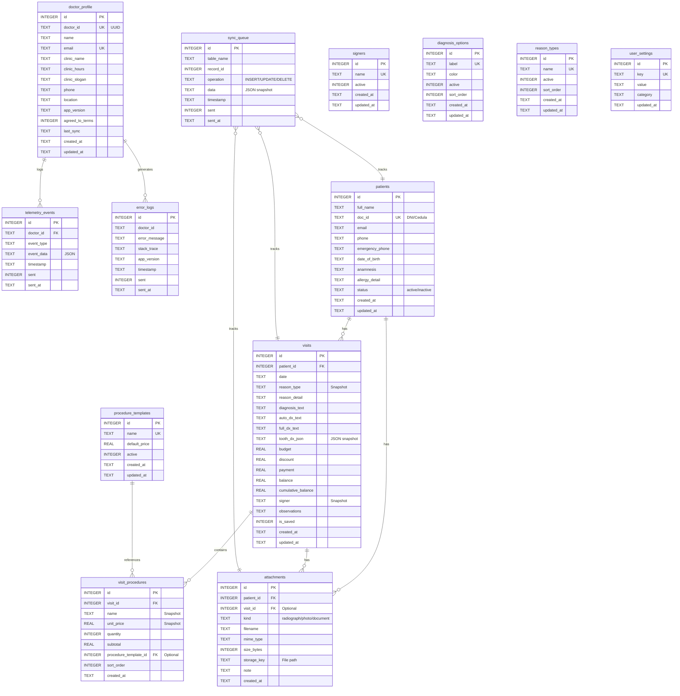

# Entity Relationship Diagram - Dentix Desktop

## Overview

Dentix uses a **denormalized SQLite schema** designed for offline-first operation with intentional snapshot semantics. Historical data is immutable - visit records preserve the exact state of master data at the time of visit.

## Database Configuration

**Engine**: SQLite 3.x
**Mode**: WAL (Write-Ahead Logging)
**Location**: `AppData/Roaming/com.tauri.dev/clinic.db`

**Pragmas**:
```sql
PRAGMA journal_mode = WAL;        -- Concurrent reads
PRAGMA busy_timeout = 10000;      -- 10 second timeout
PRAGMA synchronous = NORMAL;      -- Balance safety/performance
PRAGMA foreign_keys = ON;         -- Enforce referential integrity
```

## Complete Entity Relationship Diagram



## Core Tables

### doctor_profile

**Purpose**: Single doctor account information per installation

| Column | Type | Constraints | Description |
|--------|------|-------------|-------------|
| `id` | INTEGER | PRIMARY KEY | Auto-increment ID |
| `doctor_id` | TEXT | UNIQUE, NOT NULL | UUID for cloud sync |
| `name` | TEXT | NOT NULL | Doctor's full name |
| `email` | TEXT | UNIQUE, NOT NULL | Contact email |
| `clinic_name` | TEXT | NOT NULL | Clinic/practice name |
| `clinic_hours` | TEXT | - | Business hours text |
| `clinic_slogan` | TEXT | - | Marketing slogan |
| `phone` | TEXT | - | Contact phone |
| `location` | TEXT | - | Physical address |
| `app_version` | TEXT | - | Last used app version |
| `agreed_to_terms` | INTEGER | DEFAULT 0 | Terms acceptance (0/1) |
| `last_sync` | TEXT | - | Last cloud sync timestamp |
| `created_at` | TEXT | NOT NULL | Creation timestamp |
| `updated_at` | TEXT | NOT NULL | Last modification timestamp |

**Indexes**: None (single row table)

**Triggers**: `trg_doctor_profile_updated_at` - Auto-updates `updated_at` on UPDATE

**Business Rules**:
- Only one doctor profile per installation (mono-doctor model)
- `doctor_id` is UUID generated once, used for future cloud sync
- `agreed_to_terms` required before first use

### patients

**Purpose**: Patient demographics and medical history

| Column | Type | Constraints | Description |
|--------|------|-------------|-------------|
| `id` | INTEGER | PRIMARY KEY | Auto-increment ID |
| `full_name` | TEXT | NOT NULL | Patient's complete name |
| `doc_id` | TEXT | UNIQUE, NOT NULL | National ID / DNI / Cédula |
| `email` | TEXT | - | Contact email |
| `phone` | TEXT | NOT NULL | Primary phone |
| `emergency_phone` | TEXT | - | Emergency contact phone |
| `date_of_birth` | TEXT | NOT NULL | ISO date string (YYYY-MM-DD) |
| `anamnesis` | TEXT | - | Medical history (free text) |
| `allergy_detail` | TEXT | - | Known allergies |
| `status` | TEXT | NOT NULL, CHECK | `active` or `inactive` |
| `created_at` | TEXT | NOT NULL | Creation timestamp |
| `updated_at` | TEXT | NOT NULL | Last modification timestamp |

**Indexes**:
- `idx_patients_doc_id` ON (`doc_id`) - Fast lookup by ID
- `idx_patients_status` ON (`status`) - Filter active patients

**Triggers**: `trg_patients_updated_at` - Auto-updates `updated_at`

**Business Rules**:
- `doc_id` must be unique (one patient per ID)
- `status = 'inactive'` for soft delete (preserves historical data)
- Age calculated from `date_of_birth` in frontend

### visits

**Purpose**: Visit records with diagnosis and financial data (HEART OF THE SYSTEM)

| Column | Type | Constraints | Description |
|--------|------|-------------|-------------|
| `id` | INTEGER | PRIMARY KEY | Auto-increment ID |
| `patient_id` | INTEGER | FK → patients(id) | Patient reference |
| `date` | TEXT | NOT NULL | ISO date string |
| **Reason for Visit** |
| `reason_type` | TEXT | - | **SNAPSHOT** of reason category |
| `reason_detail` | TEXT | - | Additional reason details |
| **Diagnosis** |
| `diagnosis_text` | TEXT | - | Manual diagnosis text |
| `auto_dx_text` | TEXT | - | Auto-generated from odontogram |
| `full_dx_text` | TEXT | - | Combined diagnosis |
| `tooth_dx_json` | TEXT | - | **JSON SNAPSHOT** of odontogram |
| **Financial** |
| `budget` | REAL | NOT NULL, DEFAULT 0 | Total cost of procedures |
| `discount` | REAL | NOT NULL, DEFAULT 0 | Discount applied |
| `payment` | REAL | NOT NULL, DEFAULT 0 | Amount paid |
| `balance` | REAL | NOT NULL, DEFAULT 0 | `budget - discount - payment` |
| `cumulative_balance` | REAL | NOT NULL, DEFAULT 0 | Sum of previous balances |
| **Administrative** |
| `signer` | TEXT | - | **SNAPSHOT** of doctor name |
| `observations` | TEXT | - | Visit notes |
| `is_saved` | INTEGER | DEFAULT 0 | 0 = draft, 1 = saved |
| `created_at` | TEXT | NOT NULL | Creation timestamp |
| `updated_at` | TEXT | NOT NULL | Last modification timestamp |

**Indexes**:
- `idx_visits_patient` ON (`patient_id`) - Find all visits for patient
- `idx_visits_date` ON (`date`) - Date-based queries
- `idx_visits_saved` ON (`is_saved`) - Filter drafts vs saved

**Triggers**: `trg_visits_updated_at` - Auto-updates `updated_at`

**Foreign Keys**:
- `patient_id` → `patients(id)` ON DELETE CASCADE

**Business Rules - Denormalization**:
1. **Reason Type Snapshot**: `reason_type` stores TEXT, not FK
   - Rationale: Visit reason must not change if `reason_types` catalog changes
   - Example: "Dolor" stored as-is, even if deleted from catalog

2. **Signer Snapshot**: `signer` stores doctor name, not FK
   - Rationale: Historical accuracy (who signed at that moment)
   - Example: "Dr. Smith" stays even if doctor leaves practice

3. **Tooth DX JSON**: `tooth_dx_json` stores complete odontogram as JSON
   - Format: `{"11": ["Caries", "Sensibilidad"], "21": ["Obturación"]}`
   - Rationale: Immutable snapshot, independent of diagnosis_options catalog

4. **Financial Calculations**: All calculated in Rust backend
   - `balance = budget - discount - payment`
   - `cumulative_balance` = sum of all previous visit balances
   - Centralized logic prevents calculation errors

5. **Immutability**: `is_saved = 1` visits cannot be edited
   - Enforced in frontend and backend
   - Maintains audit trail

### visit_procedures

**Purpose**: Individual procedure line items per visit

| Column | Type | Constraints | Description |
|--------|------|-------------|-------------|
| `id` | INTEGER | PRIMARY KEY | Auto-increment ID |
| `visit_id` | INTEGER | FK → visits(id) | Visit reference |
| `name` | TEXT | NOT NULL | **SNAPSHOT** of procedure name |
| `unit_price` | REAL | NOT NULL | **SNAPSHOT** of price |
| `quantity` | INTEGER | NOT NULL | Number of units |
| `subtotal` | REAL | NOT NULL | `unit_price * quantity` |
| `procedure_template_id` | INTEGER | FK → procedure_templates(id) | Optional audit trail |
| `sort_order` | INTEGER | DEFAULT 0 | Display order |
| `created_at` | TEXT | NOT NULL | Creation timestamp |

**Indexes**:
- `idx_visit_procedures_visit` ON (`visit_id`) - Load all procedures for visit

**Foreign Keys**:
- `visit_id` → `visits(id)` ON DELETE CASCADE
- `procedure_template_id` → `procedure_templates(id)` ON DELETE SET NULL

**Business Rules - Denormalization**:
1. **Name Snapshot**: Stores procedure name at time of visit
   - Rationale: Historical billing accuracy
   - Example: "Limpieza simple" stays even if template renamed

2. **Price Snapshot**: Stores unit price at time of visit
   - Rationale: Invoice reflects price charged, not current price
   - Example: $50 in 2024, even if template now $60

3. **Optional Template Reference**: `procedure_template_id` for audit only
   - Can trace where procedure came from
   - Not used for data retrieval (snapshot is authoritative)

### attachments

**Purpose**: File attachment metadata (files stored on filesystem)

| Column | Type | Constraints | Description |
|--------|------|-------------|-------------|
| `id` | INTEGER | PRIMARY KEY | Auto-increment ID |
| `patient_id` | INTEGER | FK → patients(id) | Patient reference |
| `visit_id` | INTEGER | FK → visits(id) | Optional visit reference |
| `kind` | TEXT | - | `xray`, `photo`, `consent_form`, `document` |
| `filename` | TEXT | NOT NULL | Original filename |
| `mime_type` | TEXT | NOT NULL | Content type |
| `size_bytes` | INTEGER | NOT NULL | File size in bytes |
| `storage_key` | TEXT | NOT NULL | Relative file path |
| `note` | TEXT | - | User notes about file |
| `created_at` | TEXT | NOT NULL | Upload timestamp |

**Indexes**:
- `idx_attachments_patient` ON (`patient_id`) - All files for patient
- `idx_attachments_visit` ON (`visit_id`) - Files for specific visit

**Foreign Keys**:
- `patient_id` → `patients(id)` ON DELETE CASCADE
- `visit_id` → `visits(id)` ON DELETE SET NULL (general patient files)

**Business Rules**:
1. **Files Not in Database**: Only metadata in DB, files on filesystem
   - Location: `Documents/GreenAppleDental/attachments/{storage_key}`
   - Format: `p_{patient_id}/YYYY/MM/{timestamp}_{random}_{filename}`

2. **Optional Visit**: `visit_id` can be NULL
   - NULL = General patient file (ID card, consent forms)
   - NOT NULL = Visit-specific (X-rays from that day)

3. **Size Tracking**: `size_bytes` for storage management
   - Frontend shows human-readable size (KB, MB)

## Master Data Tables

### procedure_templates

**Purpose**: Reusable procedure catalog

| Column | Type | Constraints | Description |
|--------|------|-------------|-------------|
| `id` | INTEGER | PRIMARY KEY | Auto-increment ID |
| `name` | TEXT | UNIQUE, NOT NULL | Procedure name |
| `default_price` | REAL | NOT NULL, DEFAULT 0 | Default price |
| `active` | INTEGER | NOT NULL, DEFAULT 1 | Active flag (0/1) |
| `created_at` | TEXT | NOT NULL | Creation timestamp |
| `updated_at` | TEXT | NOT NULL | Last modification timestamp |

**Indexes**: `idx_procedure_templates_active` ON (`active`)

**Triggers**: `trg_procedure_templates_updated_at`

**Initial Data** (17 procedures):
```sql
'Curación', 'Resinas simples', 'Resinas compuestas',
'Extracciones simples', 'Extracciones complejas',
'Correctivo inicial', 'Control mensual',
'Prótesis total', 'Prótesis removible', 'Prótesis fija',
'Retenedor', 'Endodoncia simple', 'Endodoncia compleja',
'Limpieza simple', 'Limpieza compleja', 'Reposición', 'Pegada'
```

### signers

**Purpose**: Doctors/dentists who sign visit records

| Column | Type | Constraints | Description |
|--------|------|-------------|-------------|
| `id` | INTEGER | PRIMARY KEY | Auto-increment ID |
| `name` | TEXT | UNIQUE, NOT NULL | Doctor name |
| `active` | INTEGER | NOT NULL, DEFAULT 1 | Active flag (0/1) |
| `created_at` | TEXT | NOT NULL | Creation timestamp |
| `updated_at` | TEXT | NOT NULL | Last modification timestamp |

**Indexes**: `idx_signers_active` ON (`active`)

**Triggers**: `trg_signers_updated_at`

**Initial Data**: `Dr. Ejemplo 1`, `Dra. Ejemplo 2`

### diagnosis_options

**Purpose**: Diagnosis options for odontogram

| Column | Type | Constraints | Description |
|--------|------|-------------|-------------|
| `id` | INTEGER | PRIMARY KEY | Auto-increment ID |
| `label` | TEXT | UNIQUE, NOT NULL | Diagnosis name |
| `color` | TEXT | NOT NULL, DEFAULT 'info' | Badge color |
| `active` | INTEGER | NOT NULL, DEFAULT 1 | Active flag (0/1) |
| `sort_order` | INTEGER | NOT NULL, DEFAULT 0 | Display order |
| `created_at` | TEXT | NOT NULL | Creation timestamp |
| `updated_at` | TEXT | NOT NULL | Last modification timestamp |

**Indexes**:
- `idx_diagnosis_options_active` ON (`active`)
- `idx_diagnosis_options_sort_order` ON (`sort_order`)

**Triggers**: `trg_diagnosis_options_updated_at`

**Initial Data**: `Caries (danger)`, `Gingivitis (warning)`, `Fractura (danger)`, `Pérdida (secondary)`, `Obturación (success)`, `Endodoncia (info)`

### reason_types

**Purpose**: Visit reason categories

| Column | Type | Constraints | Description |
|--------|------|-------------|-------------|
| `id` | INTEGER | PRIMARY KEY | Auto-increment ID |
| `name` | TEXT | UNIQUE, NOT NULL | Reason name |
| `active` | INTEGER | NOT NULL, DEFAULT 1 | Active flag (0/1) |
| `sort_order` | INTEGER | NOT NULL, DEFAULT 0 | Display order |
| `created_at` | TEXT | NOT NULL | Creation timestamp |
| `updated_at` | TEXT | NOT NULL | Last modification timestamp |

**Indexes**:
- `idx_reason_types_active` ON (`active`)
- `idx_reason_types_sort_order` ON (`sort_order`)

**Triggers**: `trg_reason_types_updated_at`

**Initial Data**: `Dolor`, `Control`, `Emergencia`, `Estética`, `Otro`

### user_settings

**Purpose**: Application configuration

| Column | Type | Constraints | Description |
|--------|------|-------------|-------------|
| `id` | INTEGER | PRIMARY KEY | Auto-increment ID |
| `key` | TEXT | UNIQUE, NOT NULL | Setting key |
| `value` | TEXT | NOT NULL | Setting value |
| `category` | TEXT | NOT NULL | `appearance`, `sync`, `notification` |
| `updated_at` | TEXT | NOT NULL | Last modification timestamp |

**Indexes**:
- `idx_user_settings_key` ON (`key`)
- `idx_user_settings_category` ON (`category`)

**Triggers**: `trg_user_settings_updated_at`

**Initial Data**:
```sql
('theme', 'dark', 'appearance')
('brandHsl', '172 49% 56%', 'appearance')
('font', 'Inter', 'appearance')
('size', '16', 'appearance')
```

## Future/Observability Tables

### telemetry_events

**Purpose**: Analytics events buffer (offline-first telemetry)

| Column | Type | Constraints | Description |
|--------|------|-------------|-------------|
| `id` | INTEGER | PRIMARY KEY | Auto-increment ID |
| `doctor_id` | TEXT | FK → doctor_profile(doctor_id) | Doctor reference |
| `event_type` | TEXT | NOT NULL | Event name |
| `event_data` | TEXT | NOT NULL | JSON payload |
| `timestamp` | TEXT | NOT NULL | Event timestamp |
| `sent` | INTEGER | DEFAULT 0 | Sent flag (0/1) |
| `sent_at` | TEXT | - | Sent timestamp |

**Indexes**:
- `idx_telemetry_flush` ON (`sent`, `timestamp`) - Fast flush query
- `idx_telemetry_doctor` ON (`doctor_id`)

**Foreign Keys**: `doctor_id` → `doctor_profile(doctor_id)` ON DELETE CASCADE

**Business Rules**:
- Events buffered locally when offline
- Flushed to analytics service when online
- `event_data` validated as JSON in application code

### error_logs

**Purpose**: Error tracking for remote debugging

| Column | Type | Constraints | Description |
|--------|------|-------------|-------------|
| `id` | INTEGER | PRIMARY KEY | Auto-increment ID |
| `doctor_id` | TEXT | NOT NULL | Doctor reference |
| `error_message` | TEXT | NOT NULL | Error description |
| `stack_trace` | TEXT | - | JavaScript/Rust stack trace |
| `app_version` | TEXT | - | App version at error time |
| `timestamp` | TEXT | NOT NULL | Error timestamp |
| `sent` | INTEGER | DEFAULT 0 | Sent flag (0/1) |
| `sent_at` | TEXT | - | Sent timestamp |

**Indexes**: `idx_error_logs_flush` ON (`sent`, `timestamp`)

**Business Rules**:
- Critical errors logged automatically
- Sent to error tracking service when online
- Privacy: No patient data in error logs

### sync_queue

**Purpose**: Change Data Capture (CDC) for cloud sync

| Column | Type | Constraints | Description |
|--------|------|-------------|-------------|
| `id` | INTEGER | PRIMARY KEY | Auto-increment ID |
| `table_name` | TEXT | NOT NULL | Source table name |
| `record_id` | INTEGER | NOT NULL | Source record ID |
| `operation` | TEXT | NOT NULL, CHECK | `INSERT`, `UPDATE`, `DELETE` |
| `data` | TEXT | NOT NULL | **FULL JSON SNAPSHOT** after op |
| `timestamp` | TEXT | NOT NULL | Change timestamp |
| `sent` | INTEGER | DEFAULT 0 | Sent flag (0/1) |
| `sent_at` | TEXT | - | Sent timestamp |

**Indexes**:
- `idx_sync_queue_flush` ON (`sent`, `timestamp`)
- `idx_sync_queue_table` ON (`table_name`)

**Business Rules - CDC Pattern**:
1. **Full Snapshot**: `data` contains complete record state AFTER operation
   - INSERT: New record state
   - UPDATE: Updated record state
   - DELETE: Last known state before deletion

2. **Eventual Consistency**: Changes synced when connection available
   - No immediate sync requirement
   - Conflict resolution handled by cloud service

3. **Per-Table Tracking**: Each table change generates queue entry
   - Tables tracked: `patients`, `visits`, `visit_procedures`, `attachments`

## Trigger Summary

All `updated_at` triggers follow same pattern:

```sql
CREATE TRIGGER IF NOT EXISTS trg_{table}_updated_at
AFTER UPDATE ON {table}
FOR EACH ROW
BEGIN
  UPDATE {table} SET updated_at = datetime('now') WHERE id = NEW.id;
END;
```

**Tables with triggers**:
- doctor_profile
- patients
- visits
- procedure_templates
- signers
- diagnosis_options
- reason_types
- user_settings

## Index Strategy

### Primary Indexes (Foreign Keys)

- Fast JOIN performance
- Enforced by SQLite automatically for PKs

### Secondary Indexes

| Index | Purpose | Query Benefit |
|-------|---------|---------------|
| `idx_patients_doc_id` | Unique patient lookup | Instant search by ID |
| `idx_patients_status` | Filter active patients | Patient list queries |
| `idx_visits_patient` | Patient history | Load all visits for patient |
| `idx_visits_date` | Date range queries | Calendar views, reports |
| `idx_visits_saved` | Draft filtering | Find unsaved work |
| `idx_visit_procedures_visit` | Procedure lookup | Load visit procedures |
| `idx_attachments_patient` | Patient files | File manager queries |
| `idx_attachments_visit` | Visit files | Visit detail view |
| Catalog `_active` indexes | Filter active items | Master data dropdowns |
| Catalog `_sort_order` indexes | Ordered lists | Consistent display order |
| `idx_telemetry_flush` | Batch sync | Efficient flush queries |
| `idx_sync_queue_flush` | Batch sync | Efficient flush queries |

## Data Size Estimates

### Typical Clinic (1000 patients, 5 years)

| Table | Rows | Avg Row Size | Total |
|-------|------|--------------|-------|
| patients | 1,000 | 500 bytes | ~500 KB |
| visits | 10,000 | 1 KB | ~10 MB |
| visit_procedures | 50,000 | 200 bytes | ~10 MB |
| attachments | 5,000 | 150 bytes | ~750 KB |
| procedure_templates | 50 | 100 bytes | ~5 KB |
| signers | 5 | 50 bytes | ~250 bytes |
| diagnosis_options | 20 | 50 bytes | ~1 KB |
| reason_types | 10 | 50 bytes | ~500 bytes |
| **Total DB Size** | | | **~20-25 MB** |
| **Attachment Files** | 5,000 files | 2 MB avg | **~10 GB** |

**Growth Rate**: ~5 MB/year database, ~2 GB/year files

## Normalization Decisions

### ✅ Normalized

- **Master Data**: procedure_templates, signers, diagnosis_options, reason_types
  - Rationale: Reduce redundancy in living data
  - Catalog changes don't affect historical records (snapshots)

- **Patient Demographics**: Separate table
  - Rationale: One patient, many visits

### ❌ Intentionally Denormalized

- **visits.reason_type**: TEXT instead of FK
- **visits.signer**: TEXT instead of FK
- **visits.tooth_dx_json**: JSON instead of normalized teeth table
- **visit_procedures.name**: TEXT instead of FK
- **visit_procedures.unit_price**: REAL instead of FK

**Why Denormalize?**
1. **Immutable History**: Visit records are snapshots
2. **Audit Compliance**: Must show exact state at visit time
3. **Query Performance**: No joins needed for historical queries
4. **Offline Reliability**: Fewer dependencies, simpler sync

## Migration Management

**Location**: `src-tauri/migrations/`
**Execution**: Automatic on app startup
**Files**: `001_dentix_schema_final.sql`

**Migration Pattern**:
```sql
CREATE TABLE IF NOT EXISTS {table} (...);
CREATE INDEX IF NOT EXISTS {index} ON {table}({column});
CREATE TRIGGER IF NOT EXISTS {trigger} AFTER UPDATE ON {table} ...;
INSERT OR IGNORE INTO {table} VALUES (...); -- Seed data
```

**Idempotency**: All DDL uses `IF NOT EXISTS`
**Rollback**: Not needed (offline app, no multi-version deployments)

---

**Document Version**: 1.0
**Last Updated**: 2025-11-29
**Maintained By**: Development Team
